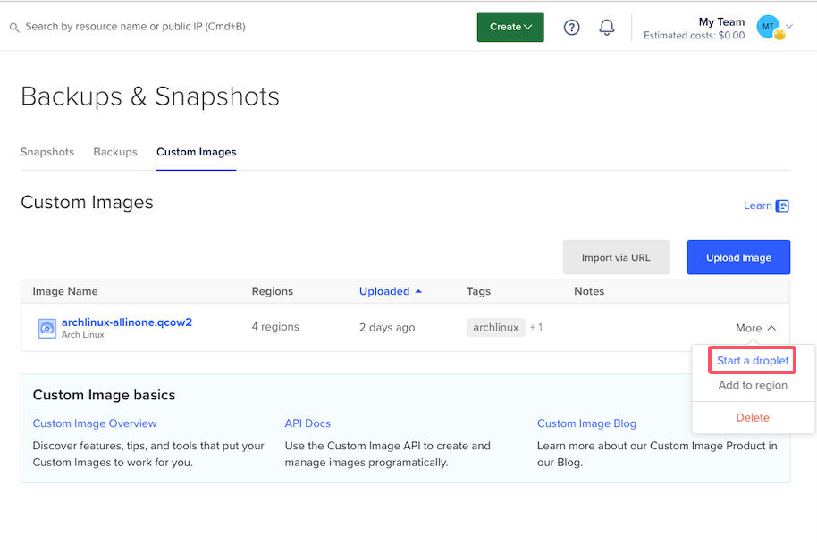
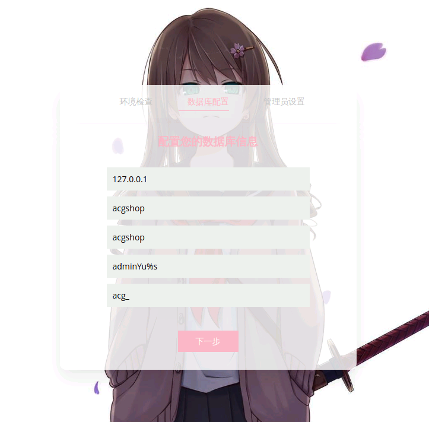
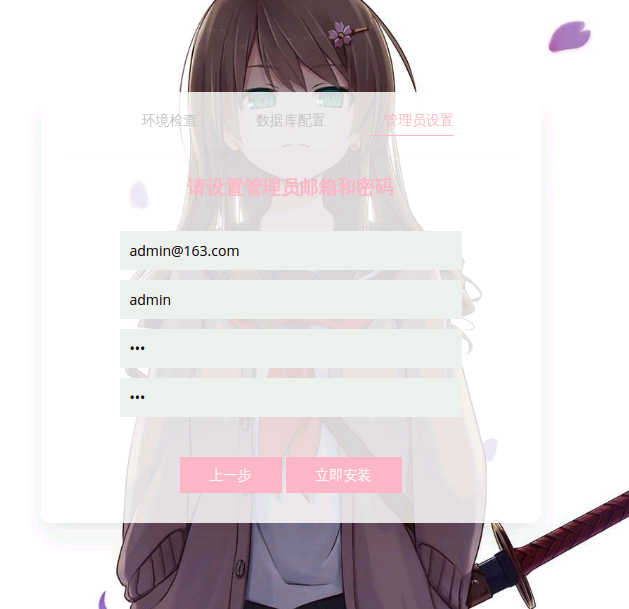

# 异次元发卡网+USDTMore 快速部署方法
Telegram群: [免费资源交流群](https://t.me/ovsealinker)

<!-- TOC -->
* [异次元发卡网 快速部署方法](#异次元发卡网-快速部署方法)
    * [搭建的环境](#搭建的环境)
    * [安装的细节](#安装的细节)
    * [相关镜像的下载地址](#相关镜像的下载地址)
    * [支持的平台](#支持的平台)
    * [开始使用](#开始使用)
<!-- TOC -->

### 搭建的环境
- ArchLinux 2024-09-05 最新版;
- MySQL 8.0.36;
- PHP 8.3.11;
- Nginx 1.26.2;
- USDTMore 1.0.0;
- acg-faka 1.3.1;

### 安装的细节
- 默认密码: adminYu%s ,默认密码包括: root, mysql的acgshop用户密码, marzban的admin用户密码;
- MySQL的配置文件&数据目录: /etc/mysql/my.cnf   /srv/mysql/
- USDTMore的配置文件&数据目录: /etc/usdtmore.conf  /var/lib/usdtmore/
- 程序路径: /srv/http

### 相关镜像的下载地址

dd的镜像:    https://ovsea.link/sysimages/archlinux-allinone.raw.xz

支持上传镜像: https://ovsea.link/sysimages/archlinux-allinone.qcow2

### 支持的平台
- DigitalOcean  这个机器可以白嫖，自己用注册用学生包，也可以购买，100块钱一年，可以开4台

  网站：[Digital Ocean](https://www.digitalocean.com)
  
  位置：全球

    创建 Arch Linux VM 的步骤：

    - 复制镜像地址 https://ovsea.link/sysimages/archlinux-allinone.qcow2
    - Backups & Snapshots, Custom Images, Import via URL, 将其导入为自定义映像
    - 从自定义映像创建新 VM
  
    - 通过 SSH 连接到 VM：ssh root@ip
    - 也可以直接通过 http://ip/ 打开发卡网

- Hetzner Cloud

  网站：[Hetzner Cloud](https://hetzner.cloud/?ref=svkrg3K6LSwv)

  位置：德国 美国

    创建 Arch Linux VM 的步骤：

  - 购买VPS
  - Rescue, Enable rescue & power cycle
  - 点 >_ 进入控制台， 先按 1 挂在磁盘， 然后是5 进入交互模式
  - 输入命令:

        wget -O- https://ovsea.link/sysimages/archlinux-allinone.raw.xz | xzcat | dd of=/dev/vda status=progress
  
        reboot

  - 通过 SSH 连接到 VM：ssh root@ip
  - 也可以直接通过 http://ip/ 打开发卡网

### 开始使用

- 创建Telegram Bot

  打开 @botfather 创建自己的机器人，并且复制 token

- 如何获取参数 TG_BOT_ADMIN_ID
  
  Telegram 搜索 @GetTheirIDBot 机器人并启用，点用户，然后把人选进来就能看到 ID

- SSH链接上以后, 编辑USDTMore的配置机器人信息

      nano -w /etc/usdtmore.conf

      TG_BOT_ADMIN_ID=
      TG_BOT_TOKEN=

- 重新启动服务

      systemctl restart usdtmore

- 进入 http://ip/ 进行进行安装即可

    

- 设置系统管理员邮箱、账号和密码

    
